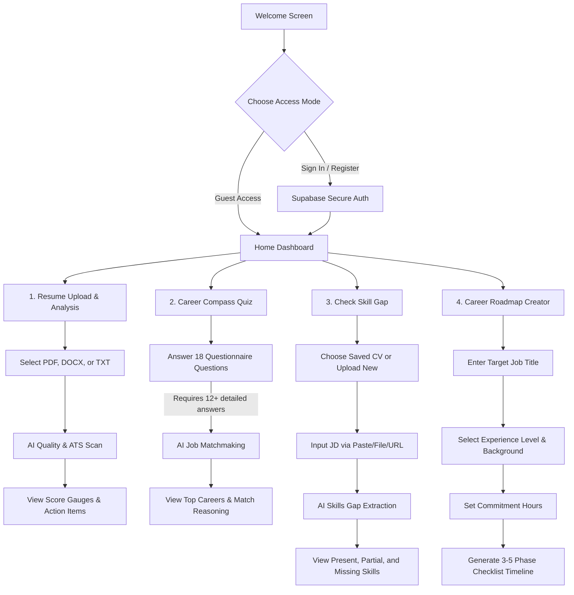

# 🧭 CV2Career — Comprehensive User Guide

Welcome to the **CV2Career** User Guide! This document provides detailed, step-by-step instructions on how to use the 4 major features of the application, manage your profile, understand guest limits, and optimize your resume for the AI model.

---

## 🗺️ Application Overview & User Flow

Here is a high-level view of how you can navigate the CV2Career application, whether you are using the app as a **Guest** or a **Registered User**:

---

## 🔍 Feature 1: Resume Intelligence (ATS & Quality Check)

The **Resume Intelligence** module evaluates your resume against standard Applicant Tracking System (ATS) parsing rules and overall quality guidelines using advanced LLaMA 3.3 AI.

### 📋 Necessary Steps to Use:
1. **Navigate to Resume Upload:**
   * Tap the **Upload Resume** card on the Home Dashboard.
2. **Select Your Resume File:**
   * Tap the central upload area to open your device's file picker.
   * Select a resume in `.pdf`, `.docx`, or `.txt` format (maximum file size is **5 MB**).
3. **Trigger AI Analysis:**
   * Tap **Analyse Resume**.
   * Wait as the system uploads, parses, and analyses the file (indicated by the real-time status overlay).
4. **Review Results:**
   * Once completed, you will be shown the **Analysis Result** screen.

### 📊 What You Get:
* **Double Scoring Gauges:**
  * **Overall Score:** Evaluates visual hierarchy, standard sections, and language clarity.
  * **ATS Score:** Measures keyword density, structure readability, and formatting compatibility.
* **Vulnerability Spotting:**
  * **Missing Sections:** Identifies crucial sections absent from your CV (e.g., LinkedIn URL, Profile Summary).
  * **Weak Language:** Detects vague phrases (e.g., "responsible for", "handled") and recommends action-oriented alternatives.
  * **Missing Keywords:** Lists critical industry keywords your CV is missing.
* **Structured Suggestions:** Clear, actionable items classified into **Add** (new details needed), **Remove** (outdated/clunky content), and **Improve** (restructuring tips).

💡 *Tip: For best results, use standard headings like "Experience", "Education", and "Skills", and avoid complex tables or images.*

---

## 🧭 Feature 2: Career Compass (Path Matchmaking)

The **Career Compass** acts as a professional matchmaking engine, analyzing your personal motivations and cross-referencing them with your resume background to suggest ideal career paths.

### 📋 Necessary Steps to Use:
1. **Launch the Compass:**
   * Tap the **Career Compass** card on the Home Dashboard or the **Explore Career Compass** button on the Resume Analysis screen.
2. **Complete the Questionnaire:**
   * You will be presented with **18 open-ended, free-text questions** (one per page) divided into life areas:
     * *Who You Are*
     * *Work Style*
     * *Interests*
     * *Values*
     * *Skills*
     * *Career Direction*
   * Type detailed, honest answers (minimum 10 characters per answer; gibberish is auto-detected).
3. **Submit the Assessment:**
   * You can skip individual questions, but you must answer **at least 12 questions** to submit.
   * Once you reach the minimum, a **Submit** button appears in the app bar. Tap it to start matchmaking.
4. **Discover Match Results:**
   * The AI returns a list of matching career domains (e.g., frontend engineer, DevOps engineer) with match percentages, targeted reasoning, required skill lists, and industry certifications.

💡 *Tip: Provide descriptive sentences (e.g., "I enjoy building user-friendly web pages using Javascript" instead of just "coding") for highly accurate matches.*

---

## 🎯 Feature 3: Skill Gap Analyser

The **Skill Gap Analyser** matches your current CV against the specific requirements of any job description (JD) you paste, upload, or link, showing you exactly what is missing and how to acquire it.

### 📋 Necessary Steps to Use:
1. **Navigate to Skill Gap:**
   * Tap the **Check Skill Gap** card on the Home Dashboard.
2. **Select Your CV:**
   * Choose **Use Saved Primary CV** (available for logged-in users who saved a resume) or choose **Upload a different CV** and select a file.
3. **Provide the Job Description:**
   Choose one of three tabs to input the job requirements:
   * **Paste Text:** Paste raw text directly from the job board. (Most reliable)
   * **Upload File:** Upload the PDF, Word document, or TXT file detailing the job.
   * **Paste URL:** Paste the web link to the job listing.
4. **Run Analysis:**
   * Tap **Analyse Skill Gap**.
   * Review the breakdown on the **Skill Gap Screen**.

### 📊 What You Get:
* **Visual Skill Alignment:** Segregates skill requirements into:
  * **Present:** Successfully demonstrated in your resume.
  * **Partial:** Mentioned but needs detail or validation.
  * **Missing:** Completely absent but required for the job.
* **Upskilling Roadmap:** A list of recommended credentials, courses (e.g., Coursera, Udemy, freeCodeCamp), and certs sorted by priority.

> [!WARNING]
> Due to anti-bot measures, job boards (e.g. LinkedIn, Indeed) often block automated page readers. If fetching via URL fails, please copy-paste the text directly using the "Paste Text" tab.

---

## 🗺️ Feature 4: Interactive Career Roadmaps

The **Career Roadmap** feature constructs a step-by-step career transition plan based on where you are today and where you want to be.

### 📋 Necessary Steps to Use:
1. **Navigate to Career Roadmap:**
   * Tap the **Career Roadmap** card on the Home Dashboard.
2. **Step 1: Define Target Role:**
   * Type in your target job title (e.g., "Software Engineer") or select from popular suggestion chips.
3. **Step 2: Enter Experience & Background:**
   * Select your current scenario (e.g., Student, Career Switcher, Tech Professional).
   * Select your target-related experience (Beginner, Intermediate, Advanced).
4. **Step 3: Define Skills & Commitment:**
   * Enter your current skills (e.g., "Python, Git").
   * Select your daily study hours budget (1-2 hours, 3-4 hours, 5+ hours).
5. **Generate & Track:**
   * Tap **Generate Roadmap**.
   * Review the generated 3-5 phase interactive checklist.
   * Check off milestones as you learn and click direct links (e.g., MDN, roadmap.sh) to access learning portals.

---

## 👥 Profile & Account Capabilities

The application supports both Guest Access and Registered User Accounts:

| Capability | Guest User 👤 | Registered User 🔒 |
| :--- | :---: | :---: |
| **Resume Analysis** | ✅ Yes | ✅ Yes |
| **Career Compass** | ✅ Yes | ✅ Yes |
| **Skill Gap Analyser** | ✅ Yes | ✅ Yes |
| **Interactive Roadmaps** | ✅ Yes | ✅ Yes |
| **In-Memory Retention** | ⚠️ Temporary | ✅ Permanent |
| **Primary CV Save** | ❌ No | ✅ Yes |
| **Score Trend History** | ❌ No | ✅ Yes |
| **Custom Display Name & Avatar** | ❌ No | ✅ Yes |

### 🔒 Saving Your Progress:
To ensure your resume uploads, compass results, and roadmaps are not lost when closing the application, register for an account from the Profile tab or sign in using a verified email address.
